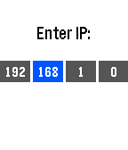

#Pebble Controller

Pebble Controller is a pebble app that allows you to use your pebble as
a controller for your pc. The app prompts you for a destination IP address and
sends information on each button press to a server running on port 5000 at that
IP. Currently, the server simply executes a script hook that simulates mac key
presses, but changing these scripts (or the server itself) would easily allow
this to be used on any os. 

Feel free to open github issues for bug reports or to provide feedback.

##Setup Watchapp


~~1. Clone the repo~~

~~2. Install pebble sdk (or use cloudpebble, I think thats possible)~~

~~3. Build the app and install it on your pebble~~ 

Pebble-controller is now available on the pebble appstore. Find it
[here](https://apps.getpebble.com/en_US/application/556a32990bfdada493000060)

##Setup Server

###Easiest Method - OS X only :( 

1. Download the mac app from
   [here](https://github.com/andars/pebble-controller/releases)

2. Create a directory in your home folder called `.pc_handlers`, and place
   files titled `0.sh`, `1.sh`, `2.sh`, and `3.sh` inside. These scripts will
   be invoked when the corresponding buttons are pressed. See [an
   example](master/server/rust/handlers)

3. Start the mac app and enjoy

###Experimental Jar File

1. Download the jar file from
   [here](https://github.com/andars/pebble-controller/releases)

2. Create a directory in your home folder called `.pc_handlers` and place files
   titled `0`, `1`, `2`, and `3` inside. Mark these scripts/executables as
   executable and they will be invoked when the buttons are pressed. See the
   example linked above.

###Alternative #1 - Ruby

*Prerequisites: ruby, bundler*

1. Clone this repo

2. Modify the handler scripts `server/handlers` to your heart's content 

3. Start the server with:

``` 

cd server
bundle install
ruby server.rb

```

4. Run the app and enter your desired ip address

5. Good to go!

###Alternative #2 - Rust

*Prerequisites: Rust, cargo*

1. Clone this repo

2. Navigate to `server/rust`

3. 

```

cargo run --release

```

##Suggested Uses

This was originally developed as a method to control presentations with
a pebble and was once tied to [RevealJS](https://github.com/hakimel/reveal.js).
It works well for this use case, so go ahead and test it out
[here](http://lab.hakim.se/reveal-js/#/). 

Now it has become more flexible so use it for whatever you wish.

##Screenshot



##License

MIT. See [LICENSE](LICENSE)
